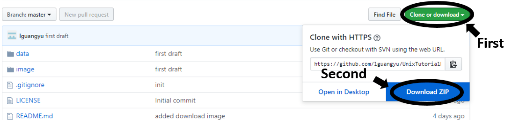

UNIX tutorial part2: grep, sed, for and intro to regular expressions
====================================================================

Download
--------

Download this repository as shown below
;

Decompress it to some convenient location.

Prepare
-------

### UNIX/Linux users

Know how to invoke `terminal` window, also practice tutorial part1.
Some commands will be used intensively in this part.

### MacOS users

MacOS shares most standard UNIX commands. Be noted that file names are case-<b>insensitive</b> on MacOS (and Windows).
We however follow the UNIX/Linux standard which uses case-<b>sensitive</b> file system.

### Windows users

Windows has different CLI (command-line interface) style than UNIX-like systems,
	and quite a bit of commands cannot be found on either `DOS` or `PowerShell`.
User can select any solution below:

* Using virtual machine (e.g. `virtualbox` or `vmware`) to install a Linux distribution.
	An example tutorial can be found here [https://askubuntu.com/questions/142549/how-to-install-ubuntu-on-virtualbox](https://askubuntu.com/questions/142549/how-to-install-ubuntu-on-virtualbox).
* Download and install either `MinGW` or `Cygwin` terminal emulator.
	Note, some commands, like `grep` and `sed` may need to be installed separately through the `MinGW` or `Cygwin` manager.
	Be sure to install the correct architecture build (for most PC/laptops today, it's x86-64 or 64bit).
	I can help the installation but right before the group meeting is a bad idea since it takes a while to download and install all the parts.
* Using webservice that has UNIX CLI, either using Jupiter suggested by Chris, or connecting into to a Linux server.
* (For Windows 10 users only) Windows 10 contains a Linux subsystem distributed through official Microsoft app store.
	Please follow the link here [https://docs.microsoft.com/en-us/windows/wsl/install-win10](https://docs.microsoft.com/en-us/windows/wsl/install-win10) to enable and install.
	Note this subsystem needs Windows 10 developer mode enabled and installation requires administrator previlige.

Convensions
-----------

Following conventions are made in this tutorial (these are all general convensions/standards on UNIX/Linux systems):

* File names are case-sensitive;
* File names do NOT contain special characters (any character other than digits(0-9), alphabetical(a-z and A-Z), dot(.), underscore (\_) and dash (-));
	especially, highly recommended NOT use spaces or any parenthese ((), [], <> or {});
* File names begin with digits, alphabetical or underscore;
* Line ending is '\n' (default on UNIX/Linux, MacOS 9 and later); Windows-standard EOL is '\r\n' which may not correctly show the line break in some editors;
