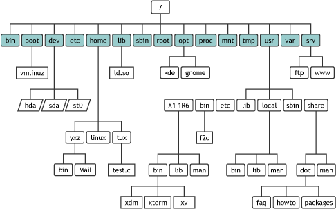
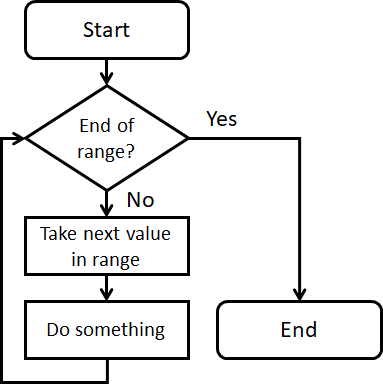

## Linux file system brief

When starting a terminal, you should see some thing below:

```
Alice@PC: ~$ ....
```

The first part is in `user@host` format (by default).
E.g. `Alice` is the user name you currently logged in,
	`PC` is the name of the host (computer, server, etc.).

The second part tells the current directory you are in,
	e.g. `~` in the above example;
	`~` is the shortcut to refer to the user's `home directory`.
By default system setting, Alice's home directory is `/home/Alice`
	(may be changed by the system adminitrator).
Below command also shows your home directory path
	by using environment variable `$HOME`:

```bash
echo $HOME
```

The last dollar sign `$` indicates you are in *normal previlige*;
	a superuser (with adminitrative previlige) will see a `#` instead.

### Absolute and relative path



`Absolute path` is the complete path to locate a file.
It starts from the root of file system,
	on UNIX-like systems, this is the system root `/`,
	on Windowds, this is any volume drive root, e.g. `C:\`.
Absolute path is unique, hence refer to a file from *anywhere*
	results identically to that file.
	(it is equivalent to say there is only one *system root directory* per system).

`Relative path` is a shortcut to refer to a file
	*relative to current directory*
	(absolute path of current directly can be acquired by `pwd`).
Hence files specified by relative path from different locations are different,
	for example Alice types `cd Documents` in her home directory descends into `/home/Alice/Documents`,
	while Bob does the same thing in his home directly (`/home/Bob`) will descend into `/home/Bob/Documents`.
You can always refer to the current location by `.`, e.g. `./fastq/R1.fastq`,
	which is identical to `$(pwd)/fastq/R1.fastq`.
By default, `fastq/R1.fastq` has identical behavior, which `./` is implicitly added.

### Good practice to use absolute/relative paths

Absolute path:

* Referring to a system file/executable that should be system-wise unique;
	examples include a reference file from another user's directory,
	a shared database file, etc.
* Too many `..` (upper directory) calls needed to make a relative path.
* Override system environments, e.g. force using `/shared/centos7/python/3.7.1/bin/python3`
	instead of direct call `python3` (which is usually `/usr/bin/python3`).

Relative path:

* Cross-reference between files that should be kept as isolated, enclosed and portable.
* Subdirectories of a project or sample.


## `for` loop

`for` command is the most used "loop structure", means to do repetitive work
	with each input value down a list.
This structure can be represented as below:



Shell script has a `for` loop in below syntax:

```bash
for i in <expression>; do
	<execute some work with $i>
done
```

The `expression` generates a list of values.
In each `for` loop, the variable `i` is assigned with each value;
	this value can be accessed by dereferencing the variable `$i` in the
	executions;

Above code can be written into a single-line mode:

```bash
# note the semi-colon ';' before done cannot be omitted in this case
for i in <expression>; do <execute with $i>; done
```

Using `i` as the variable name in loops is a convention used
	in almost all programming languages
	(i stands for "iterator");
The naming convention for concurrent multiple iterators is `i`, `j`, `k`...,
	but usually not exceeds `l`.

### Examples

#### 1. Loop through a text file

By default, `for` loop keep reading until hit any 'white space'
	(including line-break, space or tab, etc.).
Check the output of below command.

```bash
# echo is a convenient command to print the content in a variable to the terminal
for i in $(cat ./data/nar_list.tsv); do echo $i; done
```

#### 2. Loop through a specific column

Note the `<expression>` of `for` is essentially some output of those commands,
	we can replace it with other commands, for example, `cut`:

```bash
for i in $(cut -f 1 ./data/nar_list.tsv); do echo $i; done
# note for this example it is identical to directly invoke cut -f 1
# while in a for loop, we can do something else with each value, e.g. search via NCBI
```

#### 3. Loop through a directory

We can also combining `for` with `ls`,
	this is extremely useful when we want to process a set of files/samples:

```bash
for i in $(ls ./data/fastq); do
	# this calculates the number of seqs in fastq file using regular expression
	# the search pattern will be explained later
	echo "$i has $(grep -P '^@SN\d+' ./data/fastq/$i | wc -l) fastq seqs"
done
```

#### 4. Nested loops

When one loop is in the commands section of another loop, it is named "nested loop", e.g.:

```bash
for i in <outer_loop_expression>; do
	for j in <inner_loop_expression>; do
		<some command with $i and $j>
	done
done
```

For each outer loop, an entire inner loop will be executed;
	the total number of times to execute `<commands>` is number of `i`'s times number of `j`'s.
Take a loop at below toy multiplication example:

```bash
for i in {1..9}; do
	for j in {1..9}; do
		let product=$i*$j
		echo "$i*$j=$product"
	done
done
```


## Intro to regular expression

Regular expression (`regex`) is a powerful tool to define a *pattern* of string;
	this pattern then can be used for searching, extraction or substitution.
Each regex is composed from regular letters (string literals)
	and *meta-characters*, which has special meanings.
The meta-characters are where the magic happens.
Many programming languages natively support or have external libraries for regex operations,
	such as `c++`, `java`, `python`, `R` and hundreds more.

There are multiple levels (standards) of regular expression syntax:

* basic
* basic (POSIX)
* extended
* Perl-compatible (PCRE)

Each higher level supports a superset of meta-characters.
We will focus the <b>extended</b> and <b>Perl-compatible</b> standards.

### Literal match

Now type below command in the terminal to enhance the behavior of `grep`,
	we will use this to highlight which part is hit by the regex pattern:

```bash
alias grep='grep --color=auto'
```

Any bare string contains only non-metacharacters are *string literals*,
	e.g. any alphabeticals (a-z and A-Z), digits (0-9), underscore (\_),
	and <b>some</b> other special characters.

```bash
echo "abcab" | grep 'ab'
echo "_abc def" | grep '_ab'
echo "_abc def" | grep 'c d'
```

### Meta-characters

#### 1. Line start/line ending anchor: `^` and `$`

```bash
# this matches all three 'try's
echo "try try try" | grep 'try'
# this matches only the first 'try
echo "try try try" | grep '^try'
# this matches only the last 'try
echo "try try try" | grep 'try$'
```

#### 2. Word break: `\<` and `\>`

`\<` matches start of a word, i.e. the boundary
	where a non-word character followed by a word-character.
The `\>` finds the opposite, i.e. the boundary of the ending of a word.
Note: word-character is any alphabeticals (a-z, A-Z), digits (0-9) and underscore (\_).

```bash
echo "try_try try.try-try0try" | grep 'try'
echo "tryAtry_try try.try-try0try" | grep '\<try'
echo "tryAtry_try try.try-try0try" | grep 'try\>'
```

#### 3. Wildcard `.`

`.` matches any single character (but not the line-ending by default).

```bash
echo "aaa_bbb aaa.bbb-aaa0bbb" | grep 'aa.b'
```

#### 4. Quantifier `*`, `{}` and `?`/`+` (extended only)

`*` does a greedy match (as many repeats as possible) of the subpattern it follows;
	matching times can be 0 or more times.

```bash
echo "ab" | grep 'abc*'
echo "abc" | grep 'abc*'
echo "abcccccc" | grep 'abc*'
```

`{<int>[,int]}` does a greedy match of the subpattern it follows
	with specified times (can be a range);
	this syntax is available in extended regex only.

```bash
echo "ab" | grep -E "abc{0}"
echo "ab" | grep -E "abc{1}"
echo "abccc" | grep -E "abc{1}"
echo "abccc" | grep -E "abc{1,2}"
echo "abccc" | grep -E "abc{,1}"
echo "abccc" | grep -E "abc{1,}"
```

`?` does a greedy match of the subpattern it follows, matching 0 or 1 times;
	this is the short cut of `(subpattern){,1}`.

```bash
echo "ab" | grep -E "abc?"
echo "abc" | grep -E "abc?"
echo "abcc" | grep -E "abc?"
```

`+` does a greedy match of the subpattern it follows, matching 1 or more times;
	this is the short cut of `(subpattern){1,}`.

```bash
echo "ab" | grep -E "abc+"
echo "abc" | grep -E "abc+"
echo "abcc" | grep -E "abc+"
echo "abccc" | grep -E "abc+"
```

#### 5. Range of characters `[]`

`[]` contains a collection of characters, match any character in this collection.
Note any meta-character (except '^') loses magics inside `[]`,
	they are all treated as their literal values.

```bash
# matches a or d or f
echo "abcdefg" | grep '[adf]'
# any character inside [] is literal
echo "a.as1w0-b??QqT392.$" | grep '[$b]' # matches `$` or `b`
echo "a.as1w0-b??QqT392.$" | grep '[.?$]' # matches `.`, `?` or `$`
# a range of characters can be set inside [] for shortcut
echo "a.as1w0-b??QqT392.$" | grep '[a-b]' # matches any small-character between a and b
echo "a.as1w0-b??QqT392.$" | grep '[a-z]' # matches any small-character
echo "a.as1w0-b??QqT392.$" | grep '[A-Z]' # matches any capital-character
echo "a.as1w0-b??QqT392.$" | grep '[0-9]' # matches any digit
```

Now we can do some combined magics:

```bash
echo "a.as1w0-b??QqT392.$" | grep '[a-zA-Z]' # matches any alphabetical
echo "a.as1w0-b??QqT392.$" | grep '[a-zA-Z0-9]' # matches any alphabetical or digit
echo "a00,a01,a02,a03,a9,aa,ab00" | grep -E 'a[0-9]+' # matches any `a` followed immediately by at least one digit
```

If the first character in `[]` is `^`, it turns to match any characters NOT in the specified collection.

```bash
echo "a.as1w0-b??QqT392.$" | grep '[^a-zA-Z]' # matches any non-alphabetical
```

#### 6. Subpattern (grouping) `()` (extended regex only)

Part of the pattern can be combined into subpattern (group);
	a group act as a whole and can be combined with quantifiers or other operations.

```bash
echo "abcbcbcbcbc" | grep -E 'a(bc){2}' # this is eq. to "abcbc"
```

Subpattern also serves as a `capture` function which is the core mechanism
	in substitution (explained in `sed` section).


#### 7. Logical or on subpatterns `|` (extended regex only)

`|` matches subpattern on its either side.

```bash
echo "abcsssdefbbbefd" | grep -E '(abc)|(def)'
```

#### 8. Escape character `\`

`\` generally cancels the magic of meta-charaters and turns it into a literal match,
	for example:

```bash
echo 'a$b' | grep '\$'
```

Note: double escape `\\` matches a literal `\`.

### Using regex in `sed`

`sed` stands for 'Stream EDitor' that typically uses regular expression.
Its syntax is:

```bash
sed 's/<pattern>/<replace>/' [input]
```

If `input` (a file) is not specified, read from `stdin`.
By default, result writes to `stdout`.
`sed` supports an in-place editing mode (`-i`) but is usually not necessary.

#### Basic example

```bash
echo "day and night" | sed 's/day/night/' # replace day with night
```

#### Replace with capture (reference)

It is also possible to capture the pattern first, then use whatever captured in the substitution step.
Take a look into the directory `./data/fastq`, there are a bit sequencing files in long names.
We want to rename them into a short form, for example, `DU_102417_S10_L002_R1_001.fastq -> DU_102417_R1.fastq`
Note the sample name (`DU_102417` and the read direction `R1/R2`) need to be preserved).
Below codes should do the trick:

```bash
# we first make a copy
cp -r data/fastq data/fastq_copy

# first, list all files
for i in $(ls ./data/fastq_copy); do echo $i; done

# then figure out the target file name
for i in $(ls ./data/fastq_copy); do echo $i | sed -r 's/(.*)_S[0-9]+_L[0-9]+_(R[12]).*.fastq/\1_\2.fastq/'; done
# note \1 and \2 refer to the first and second group capture respectively

# now the next code will do the rename:
for i in $(ls ./data/fastq_copy); do
	new_name=$(echo $i | sed -r 's/(.*)_S[0-9]+_L[0-9]+_(R[12]).*.fastq/\1_\2.fastq/')
	cp ./data/fastq_copy/$i ./data/fastq_copy/$new_name
done
```

#### Global substitution

Now take a look at the `data/MiDAS_S123_2.1.3.tax.head20.tax` file.
This file is in QIIME format.
Note the taxonomic level label `k__`, `p__`, etc., we wish to remove them,
	i.e. do a pattern matching and and replace with empty string.
However the following doesn't work well:

```bash
sed 's/[kpcofgs]__//' data/MiDAS_S123_2.1.3.tax.head20.tax
```

Note that only the first match is replaced!
Unlike `grep`, the *standard* behavior of regex match
	only finds the first hit in each line.
To replace multiple matches in a single line, we need to enable the global option:

```bash
sed 's/[kpcofgs]__//g' data/MiDAS_S123_2.1.3.tax.head20.tax
```

Now it looks good.


### Additional applications using regular expression

#### Count number of sequences in fasta file

```bash
grep '^>' data/nar.fasta | wc -l
```

#### Parse NCBI fasta header

```bash
grep '^>' data/nar.fasta | sed -r 's/^>([^ ]*).*\[(.*)\]$/\1\t\2/'
```

This is essentially the way I generated `data/nar_list.tsv`.


## Other useful commands

### `man`: check program documentation

`man` displays the manual page of specified command
	it generally provides more information than that command's help flag
Below command invokes the manual page of grep.

```bash
man grep
```

Note you can use regex to search this manual!
The way to enable it is press slash `/`, followed by regex and enter,
	for example `/count` will jump to the position of next word `count` in the manual,
	and press `n` will travel further.


### `alias`: create shortcut for command call

`alias` can dramatically reduce the physical keystrokes in some cases.  
We already used it on the `grep` command, instead of calling `grep --color=auto` everytime.

Here is another application.
`rm` can be used for batch deletion, for example `rm *.fastq`
	will delete all fastq files in current directory.
This is somewhat dangerous, but also useful.
The safer way is call `rm -i *.fastq` which `-i` forces an interactive mode,
	offering a final file name check by explicitly requiring the user confirmation.
But use `rm -i` instead of `rm` everytime doubles the keystrokes.
The satisfied answer is use alias:

```bash
alias rm='rm -i'
```

Now every time use bare `rm` is actually calling `rm -i`;
	this effect is *temporary*,
	i.e. re-setup is required after reloading the terminal or re-login.
Note the user can still override the `-i` flag by using `-f` (force) flag,
	suppressing the confirmation.


### `ln` (link): make symbolic link to large files instead of `cp`

`cp` is good.
But sometime the file can be very large (e.g. some databases).
Copy them everywhere is a huge waste of storage space,
	but using the absolute path everytime is too complex.

The solution is called *symbolic link*, which creates a dummy file as a shortcut:

```bash
# syntax is ln -s <target_file> <symbolic_link>
ln -s ./data/MiDAS_S123_2.1.3.tax.head20.tax ./MiDAS.tax
# -s flag stands for a symbolic link, it is NECESSARY otherwise a hard link will be created
```

Now call `ls -l` to have a look at the current directory, note the symbolic link.
We can now open the symbolic file just as if we are opening the original file,
	and any writes/changes done into the sym-link will in fact be updated into the original file.
Note sym-link can also point to a directory.
